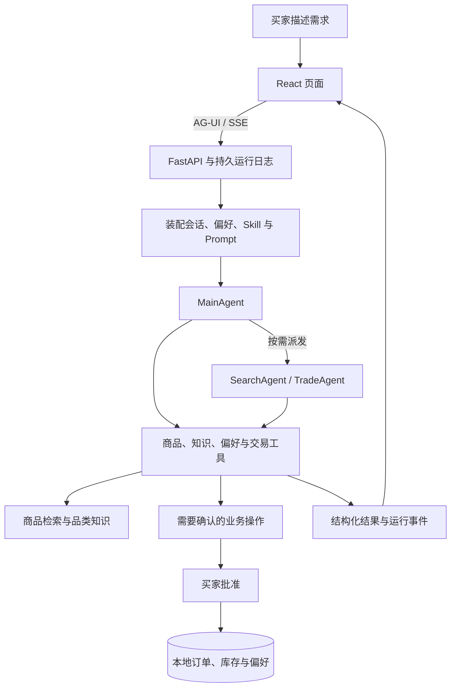

# Globex · 从商品检索到交易确认的电商 Agent

一个基于 **LangChain、LangGraph、AG-UI 和 React** 的全栈 Agent 实战项目，覆盖需求理解、商品检索、方案比较与交易确认。

2026-10-02已[收尾选购页面与澄清闭环](docs/改动记录/2026-10-02/选购页面与澄清闭环收尾.md)：普通推荐不强迫目的地，状态来源绑定真实买家消息而不要求模型抄原文；表单跟随原回复、提交后收起、刷新不复活。主界面为建议与紧凑可选商品卡，详细比较进窗口，购买复用已知国家和原确认流程。后端1669项、前端157项通过；真实DeepSeek/BGE、表单、四款比较、超预算只读和临时订单确认通过，Docker已更新。自由文案不计为全品类事实质量通过，检索模型仍按需启停。

同日最后补齐发送即停止的创建边界：先等待真实RUN_STARTED再取消，不加延时重试；最后前端158项通过，真实网页立即停止成功，最终Docker前端已更新。测试浏览器、临时服务器和检索模型均已关闭，停止阶段401及创建前404原样保留在上述记录。

2026-10-02已[贯通工具错误与执行过程](docs/改动记录/2026-10-02/工具错误到执行过程的结构化贯通.md)：参数校验保留原生位置/类型与未执行状态，业务拒绝和服务故障保留明确类别及原因，不解析报错文字猜测；前次失败和后续成功各归真实调用。后端复测1664通过/收尾定向83通过，前端155通过；Docker后端与匹配版本已启用，Prompt正文不变。旧历史摘要不改写，本次没有调用外部模型/检索作复测。

2026-10-02已[完成每轮执行过程与结果摘要](docs/改动记录/2026-10-02/每轮执行过程与结果摘要.md)：用户请求下实时展示真实动作与结果摘要，结束可展开回看；新轮、刷新和历史恢复保留原归属，不再使用旧单行进度。复用原生回执和既有日志，无额外模型或固定阶段动画。后端全量1656通过、最后定向68通过，前端154通过；真实DeepSeek/BGE、子任务派发及停止已验证，Docker已更新。推荐文字语义质量不因此计为全部通过；验收后检索模型和测试浏览器已关闭，下次检索先 `make bge-start`。

2026-10-02已[完成商品查看与购买闭环](docs/改动记录/2026-10-02/商品卡复用与同款平台分组.md#同日收尾详情抽屉与购买闭环)：同款一张卡，删除卡内下拉，点击进入现有详情抽屉选择平台和规格，可比较及准备下单；展示币种与确认金额一致，缺货不能买、超预算不阻止查看，原预算保持。前端151项、后端定向69项通过，真实DeepSeek与隔离网页账本完成确认前不成交、确认后所选SKU成交；原工具/Prompt版本保留，Docker前端已更新。下列独立详情卡为历史阶段布局，不是当前交互。

2026-10-02已[补驻留前端更新衔接](docs/改动记录/2026-10-02/驻留前端更新衔接与实际卡片核验.md)：直接核验用户Safari的故障回复，服务端两张卡已发布、驻留页面刷新后在原处显示；页面回到前台时检查现有模块入口，安全空闲后加载新版，不清空输入、对话或预算。143项前端回归通过，Docker前端已更新；此前仅验证新页面不足以覆盖该故障。

2026-10-02已[补齐独立详情展示](docs/改动记录/2026-10-02/商品详情读取与推荐筛选分离.md#同日补齐详情必须在网页可见)：Main通过show_product_details交付只读详情卡，不借推荐通道；缺货/超预算只显示状态，全部规格可见，卡片绑定本条回复。实际100元任务显示Voyager与Roamix三平台记录共3卡5行，预算与空选购项保留；后端1639通过/1跳过、前端138通过，Docker已更新。前述仅完成读取的阶段不足以作为本需求完整验收。

2026-10-02已[区分商品详情读取与推荐筛选](docs/改动记录/2026-10-02/商品详情读取与推荐筛选分离.md)：get_product_details可直接读完整资料与全部规格，缺货/超预算不阻止查看，当前限制只解释、不修改条件；product_search_tool继续筛选候选，详情不自动升级为推荐/订单依据。真实DeepSeek保持100元上限完整查看Roamix两平台资料，后端1634通过/1跳过，Docker后端已更新。

2026-10-02已[修复商品名称表达与回复卡片归属](docs/改动记录/2026-10-02/商品名称表达与回复卡片归属.md)：推荐/比较在交付前检查已核实内部ID不进入买家建议，错误反馈提供目录名称供纠正；卡片直接绑定原回复，追问和刷新不推到底部，新交付与旧批次各归原位。后端1629通过/1跳过、前端137通过，实际DeepSeek颈枕三轮与刷新验证通过，Docker已更新；旧文字不自动改写。

2026-10-02已[接入演示登录与对话管理](docs/改动记录/2026-10-02/演示登录与对话管理.md)：下拉选择kkqq/root，签名身份与缓存按账号隔离；侧栏/历史悬停三点重命名和确认删除。实际换号403隔离、改名刷新保留、删除后404及不恢复缓存已验证，Docker已更新；原有账号数据未迁移或删除。

2026-10-02已[修复侧栏最近选购裁字](docs/改动记录/2026-10-02/侧栏最近选购裁字与布局修复.md)：移除底部装饰、历史独立滚动且不被压扁，六种视口实际验证、前端133项通过，Docker前端已更新；后端、Prompt及会话数据不变。

2026-10-02已[重构研究执行与部分交付闭环](docs/改动记录/2026-10-02/研究执行与部分交付闭环重构.md)：停止后不再将全部检索命中冒充候选，当前轮已读结果可归档，收尾保留角色交付工具，部分完成时可保存和展示已成功交付的卡片；澄清成功后等待输入，completed状态不能绕过明确发布标记。原循环检测保持，不新增语义进展判定器。后端1619通过/1跳过、前端133通过；最终Docker与声明版本已启用，原开放四款请求实际完成，Langfuse诊断字段已核验。推荐文字仍有无依据推断，选品质量不计为全通过。以下为前序阶段记录。

2026-10-01已[恢复整体选购建议并精简推荐页](docs/改动记录/2026-10-01/整体选购建议与推荐页展示修复.md)：推荐/比较与建议一次交付，卡片主展示到手价，去除重复费用小字、固定目录提示与常驻澄清入口，快捷比较不再截取前三款。匹配的新工具协议/Prompt和Docker已启用；后端1605通过/1跳过，前端132通过。真实普通查询、指定四款交付/快捷比较/刷新恢复通过，Langfuse完整收到；保留网络中断及开放四款连续检索超限失败，文字事实仍未全过，不能声称整套选购通过；下面为前序阶段状态。

2026-10-01已[部署检索与推荐新版并完成实际页面复测](docs/改动记录/2026-10-01/网页新版部署与请求投影收尾.md)：网页现已使用候选池收敛、短理由Schema及匹配Prompt；追加查询保留卡片，四款可手动比较，Langfuse收到真实链路。本轮还修复查询score阻断相同商品事实共享、目录管理字段进入选购上下文的问题。后端1604通过/1跳过；推荐解释仍有无依据属性与评价排名错误，事实质量未全过，不把部署完成当作所有推荐正确。

2026-10-01已[接通Langfuse美国区项目](docs/改动记录/2026-10-01/Langfuse真实网页接入.md)，实际AG-UI请求的API/Agent/模型/工具树与用量已远端验证，错误工具记录也收到。随后[全表审查与迁移](docs/改动记录/2026-10-01/运行数据库全表审查与结构迁移.md)检查10个运行数据库、35张表，修复orders和buyer_preferences的3处缺列，记录数量不变；实际订单查询不再出现数据库异常。原始正文脱敏保持，不把Trace接通当作业务全部正确。

2026-10-01按用户要求[启用混合召回](docs/改动记录/2026-10-01/启用混合召回.md)：运行中的API/worker均为hybrid=true，BM25与向量排名经RRF融合再精排；只做启动/配置确认，未做效果评测。此次保留原已部署代码/Prompt，不等于下面工作区最新候选池及推荐改动已统一发布。

面试演示与隔离端到端验收见[执行说明](docs/面试演示与验收.md)。最新[商品参数生成源头修复](docs/改动记录/2026-10-01/商品参数生成源头修复.md)统一参数与文案来源，3700件商品均有重量及商品尺寸，包装尺寸独立保存；380g/0.33kg冲突已消除，不新增页面标注或提醒。后端1570通过、1跳过，前端131通过，Docker5173已更新，Qdrant3700条向量检查后全部复用。真实用途切换与四款比较通过（保留连接失败及定向重试）；这些结论不等于所有模型自由文本均无误。此前[推荐比较交付重构](docs/改动记录/2026-10-01/推荐与比较交付重构.md)的首选、关注点与四款比较继续保留。

当前工作区另有[推荐理由与模型输入整理](docs/改动记录/2026-10-01/推荐理由与模型输入整理.md)：合并推荐提示、明确短建议字段与币种口径，不增加润色Agent或删词逻辑。保留DeepSeek官方HTTP402失败；充值后四案例六轮真实执行通过，但人工仍发现属性推断及评价排名错误，语义验收未通过。新Docker镜像已构建但未启用，5173仍运行前述版本；不要把本地代码修改当作已部署效果。

随后[评测接入真实检索](docs/改动记录/2026-10-01/端到端评测接入真实检索.md)已移除关闭检索组件与知识替身的代码，不提供离线模式。1580项后端通过、1跳过；远端/home存储故障后，已在项目data4目录[恢复BGE服务](docs/改动记录/2026-10-01/BGE环境存储故障定位.md)，Docker实际embedding/rerank通过。购物任务11/12次精排成功，一次152篇超过服务128篇限制，整套未全通过。生产网页原本就配置BGE；此前关键词夹具数据不能证明实际网页检索需重构。

最新[连接与记忆对齐](docs/改动记录/2026-10-01/连接恢复与评测记忆对齐.md)已恢复本机隧道、删除评测JSON记忆替换。真实DeepSeek/BGE与网页AG-UI路径完成审批保存、1024维记忆持久化、新会话召回及删除后不再注入；完整1580通过、1跳过，原始失败保留。检索候选池、网页Trace及推荐新版部署仍待下一阶段，不冒称一并完成。

其后[检索候选池修复](docs/改动记录/2026-10-01/检索硬过滤与精排候选池收敛.md)已统一“硬过滤→粗排收敛→精排→Top K”，原152篇超限请求变为32款候选/23篇文本并成功精排；真实两案三轮11次精排均成功，完整1591通过、1跳过。代码尚未切换运行中的网页，按计划待Trace及最后验收统一部署；推荐自由文本的事实质量不属于本轮全通过结论。

在完整选购流程中，探索 Agent 应用的关键工程问题：如何调用业务工具、记住用户偏好、管理长对话，以及在刷新、断线和人工审批之间保持状态一致。

[快速开始](#快速开始) · [核心能力](#核心能力) · [工作原理](#工作原理) · [项目状态](#项目状态) · [开发与文档](#开发与文档)

> 当前使用版本化样例商品目录和本地订单账本，尚未接入真实电商供给、支付或物流。部分正式质量评测尚未通过，具体范围见[项目状态](#项目状态)。

> 2026-09-30 已完成 LangChain/LangGraph 运行时替换，旧 AgentScope 执行器与兼容类型已移除。Docker 后端 1459 项、前端 127 项回归通过；镜像启动与 SQLite 冒烟通过。真实模型供应商及生产效果不包含在离线结论中，详见[迁移验收记录](docs/改动记录/2026-09-30/迁移收尾与验收.md)。

## 一次选购，从描述需求开始

你可以先告诉 Globex：

> 预算 300 元以内，帮我找一个寄到中国的轻便背包。

Agent 根据需求调用检索与业务工具，检索期间只展示进度；本轮成功交付明确的推荐或比较后，最终卡片显示在产生它的助手回复下面。内部候选不会随关键词变化反复上屏，追加查询也不会把旧卡片移到对话末尾。成功交付新推荐或比较后，旧批次在原回复中只读归档；开启新选购会清空当前工作区。你可以继续比较、补充条件，或生成交易确认单。

Main 可通过 `compare_products` 直接交付候选集合的比较，与手动勾选共用同一组件及已交付商品资料。首选、理由、取舍和关注点随本次需求提交，不是固定属性矩阵。推荐/比较沿用同一12项容量上限，不要求凑满；同商品不同规格可并列，数量、目的地和币种一致才计算到手差价。比较复用现有计价，不改变选购或交易状态；成功后直接结束，不再复述报价。实现与验证见[最新记录](docs/改动记录/2026-10-01/推荐与比较交付重构.md)。

| 你可以这样说 | 对应的交互 |
| --- | --- |
| “比较刚才两个候选，重点看重量和容量。” | 查看候选商品的差异，继续缩小选择范围 |
| “记住我偏好轻便设计。” | 展示记忆变更审批，批准后保存偏好 |
| “这次不要黑色，换几个其他颜色的。” | 在当前选购中更新需求 |
| “为我选中的商品生成确认单。” | 查看交易信息，明确批准后执行本地订单与库存事务 |

常用的选购方法可以保存为个人 Skill。用户直接描述购物需求，Agent 根据目录按需读取流程正文，不需要选择 Skill；手动选择和斜杠菜单执行入口已移除。

实际回答和候选商品取决于样例目录、模型与检索配置。

## 技术栈

基于 **Python + TypeScript** 构建，使用 **LangChain + LangGraph** 编排 Agent，通过 **AG-UI** 将执行过程与结构化结果实时呈现在 React 页面。

| 层次 | 技术选型 | 在项目中的用途 |
| --- | --- | --- |
| Agent 框架 | LangChain 1.4.3、LangGraph 1.2.12（锁定版本） | 状态图执行、工具调用、子图派发、checkpoint、流式输出与 interrupt 人工审批 |
| 后端服务 | Python 3.11–3.13、FastAPI、Uvicorn | 业务 API、Agent 运行入口与流式响应 |
| 前端应用 | React 18、TypeScript、Vite | 对话界面、商品卡、Skill 编辑、偏好管理与订单页面 |
| 交互协议 | AG-UI、SSE、A2UI v0.9 | 文本、商品与运行状态；自定义 ShoppingForm 组件以 AG-UI 扩展事件传输 |
| 模型接入 | OpenAI 兼容 API | 聊天模型、工具调用与流式生成；示例配置使用通义千问 |
| 商品检索 | Embedding、Qdrant 稠密向量、应用层 BM25、加权 RRF | 权威目录过滤和补召回；专用 HTTP reranker 精排；未使用 Qdrant 稀疏索引 |
| 品类知识 | 版本化 Markdown、Embedding、Qdrant | 语义召回与来源核验；服务不可用时明确标记词项降级 |
| 持久化 | SQLite、本地文件 | 保存会话、运行事件、偏好、Skill、确认单、订单与库存 |
| 缓存与队列 | Redis、Redis Streams | 缓存、共享限流，以及旧意图接口的异步任务消费 |
| 可观测性 | OpenTelemetry、OTLP、Langfuse | 关联 API、Agent、模型和工具调用，记录运行追踪与评分 |
| 测试与评测 | 后端/前端回归测试、自定义评测脚本 | 验证业务行为，评估商品检索、知识检索、Agent 与上下文治理效果 |
| 构建与部署 | uv、npm、Docker Compose、Nginx | 依赖管理、全栈部署、静态资源服务与 API 反向代理 |

### 工程设计

- **业务分层**：采用 DDD 洋葱架构，分离领域模型、应用用例、基础设施与接口层，通过 `composition.py` 统一装配依赖。
- **Agent 协作**：MainAgent 直接处理简单任务，按需向 SearchAgent、TradeAgent 派发结构化任务，服务端注入当前购物记录；子图在整轮工具完成后校验交付，失败可有限修正且不重跑业务操作，结果独立保存。交易待确认与实际执行分开表达。实现与验证范围见[主子 Agent 任务交接](docs/改动记录/2026-09-30/主子Agent任务交接.md)。
- **上下文与记忆**：结合语义偏好召回、Skill 按需加载、工具证据保存与上下文裁剪、摘要。
- **明确条件执行**：分类仅使用 Agent 提交的目录枚举；偏好在既有提炼流程中保存材质排除、分类范围与原文依据，执行层不重新猜句意。未知条件保留为待核验；旧库需显式离线迁移，见[迁移与验证记录](docs/改动记录/2026-09-30/结构化筛选与偏好收敛.md)。
- **Skill 与请求上下文**：目录只含元数据，成功读取才激活本轮引用。主子任务统一先装配并计量系统、工具、状态和 Skill，再在剩余空间整理历史，最后校验实际请求；手动整理复用同一入口。原文、所有权、版本和只读工具范围校验保留，不支持旧 selectedSkill 或旧压缩器入口。见[模块五记录](docs/改动记录/2026-09-30/Skill渐进加载与上下文装配.md)。
- **购物需求状态**：主 Agent 通过原生工具保存一份当前条件，硬过滤、偏好、排序分开；选购项按 SKU 保存，准备订单从选购记录读取数量。无独立需求解析模型、无多目标继承。独立研究条件随子任务传入，不写回主状态。旧状态和旧下单工具入参不兼容，需新建会话；审批与证据校验保留。见[模块二记录](docs/改动记录/2026-09-30/购物工作状态重构.md)。
- **可靠性机制**：使用事务、幂等控制、会话 lease/fencing/CAS，以及持久运行日志，处理重复请求、并发写入与断线恢复。
- **失败反馈与恢复**：业务工具明确区分参数错误、业务拒绝和执行故障；模型重试仅在模型层，工具不自动重放。重复检索按业务结果判断进展，不被新证据引用或查询时间掩盖。保留原生 checkpoint 恢复与交易审批，见[模块三记录](docs/改动记录/2026-09-30/工具失败反馈与恢复.md)。
- **执行停止与部分交付**：模型层只报告预算停止；主子执行边界保留已有商品证据和交易快照，明确完成部分与缺口。预算、步数、子任务时限不再触发格式纠正，也不覆盖其他子任务成果；停止轮次关闭 checkpoint 待执行节点，不重放业务。见[模块四记录](docs/改动记录/2026-09-30/执行停止与部分成果交付.md)。


## 核心能力

### 结构化选购

商品检索、品类知识与交易工具共同支持选购流程。页面直接消费工具和业务系统返回的结构化数据，展示商品卡、规格和确认单。

预算等硬约束由代码过滤；价格、库存和订单状态依据业务数据展示。

检索按具体 SKU 核验资格，候选只包含本次符合条件且有库存的规格；默认展示价取这些规格在目标币种下的最低价。明确指定 SKU 时不会替换为其他规格。规格原文进入商品召回文本，精排只读取合格规格；详情仍能查看全部规格并解释限制。当前源码变更及验证见[按 SKU 统一核验记录](docs/改动记录/2026-10-03/检索候选按SKU统一核验.md)，运行服务是否启用以该记录为准。

### 个人 Skill 与长期偏好

用 Markdown 保存自己的选购流程，Agent 根据当前需求自主渐进式加载。个人 Skill 仅对当前买家可用，指导现有工具的使用，不扩展工具权限；既有资料管理与历史数据保留。

长期偏好支持添加、修改和删除。正向偏好按语义召回，负向约束保留用于后续选购；偏好变更记录版本与来源。

### 人工确认与交易一致性

对话中的记忆变更和交易操作通过确认流程执行。买家可以批准或拒绝，待审批状态可在刷新后恢复。

本地订单、库存与幂等记录通过数据库事务处理。页面直接编辑偏好属于显式操作，无需重复走 Agent 审批。

### 持久会话与运行恢复

会话、消息和运行事件保存在服务端。刷新或断线后，前端可以恢复已有内容，继续订阅运行结果。

断开网页不会自动取消本轮任务；点击“停止”才明确取消。API 重启后，未完成运行会标记为中断，已保存内容仍保留。

### 上下文治理与工程评测

工具完整证据与提供给模型的上下文分开保存。长对话支持裁剪、摘要和证据回查；工作状态、历史摘要及“整理上下文”放在默认收起的“查看运行记录 → 上下文详情”，不与最终回答重复占据主页面。

当前源码的搜索、详情和子任务交接共用有界模型视图，大结果首次返回即保留引用并按需回查。历史摘要采用原文条目选择：模型选择来源，程序填入完整摘录，精确金额不再由模型重写；当前购物状态独立保留。摘要 checkpoint 与统计格式直接切换，不转换旧摘要。实现、1695 项后端回归及启用边界见[上下文治理修复记录](docs/改动记录/2026-10-03/上下文治理三处边界修复.md)。

工程包含回归测试、检索评测、Agent 用例与运行证据。功能实现、测试通过和效果达标分别记录。

## 快速开始

**推荐先使用 AI 帮忙启动！！**

在编程助手中打开 `globex-agent` 工程目录，可以使用以下提示：

> 帮我启动这个项目。先阅读 README 和现有配置，检查环境与端口，保留已有 .env 和数据。安装缺失依赖，启动前后端，检查健康接口并完成一次页面选购。缺少模型凭据时说明需要配置哪些字段，不要打印密钥。最后告诉我访问地址和停止服务的方法。

启动步骤默认使用 Docker；Python、Node 和项目依赖都安装在镜像中，不在宿主机创建 `.venv` 或 `node_modules`。

### 1. 准备环境

- Docker Engine/Desktop 与 Compose v2
- 可用的模型 API 凭据

聊天模型服务需要支持 OpenAI 兼容协议、工具调用和流式输出。向量检索还需要可用的 embedding 服务。

### 2. 配置模型

首次使用时创建 `.env`，已有配置不会被覆盖：

```bash
if [ ! -f .env ]; then
  cp .env.example .env
fi
```

编辑 `.env`，填写模型服务信息：

```dotenv
LLM_BASE_URL=https://dashscope.aliyuncs.com/compatible-mode/v1
LLM_API_KEY=填写你的真实密钥
LLM_MODEL=qwen3-max
LLM_FALLBACK_MODEL=qwen-plus
EMBEDDING_MODEL=text-embedding-v4
```

以上为配置示例，模型名称应替换为当前账户实际可用的模型。

同一份 `.env` 还需填写 `DEMO_LOGIN_PASSWORD` 和 `IDENTITY_HMAC_SECRET`，保留 `IDENTITY_MODE=hmac`、`SESSION_OWNER_BINDING=1`。签名密钥可用 `openssl rand -hex 32` 生成后存入本地环境；不要复用模型 API 密钥，不放入前端配置。

Embedding 默认复用聊天模型的网关和密钥。需要独立服务时，配置 `EMBEDDING_BASE_URL`、`EMBEDDING_API_KEY` 和对应模型。

当前项目可复用本机 SSH 别名 `globex` 登录服务器：运行 `make globex-ssh`。主机、用户、端口和私钥继续由 `~/.ssh/config` 管理，不复制到工程目录。

远端 BGE-M3 / BGE-reranker-v2-m3 已部署到 `/data4/sybai/globex`，当前使用该项目的`service-runtime`环境；原glodex因/home存储故障保留未动。模型按一次开发/演示启停：`make bge-start`加载模型并连接本机隧道，用完`make bge-stop`释放GPU；不默认长期保留。Docker 检索配置在受限的 `.env.bge` 中。操作及数据边界见 [BGE 服务说明](deploy/bge/README.md)，实际启停见[改动记录](docs/改动记录/2026-10-02/检索模型按需启停.md)。

> 模型与 embedding 调用可能产生费用。首次启动会加载商品目录并尝试建立向量索引，耗时取决于服务与网络。密钥只保存在本机或服务端，不要提交到仓库。

### 3. 构建并启动

```bash
docker compose --env-file .env -f docker/docker-compose.yaml config --quiet
make docker-up
make docker-ps
```

Compose 包含 API、worker、Redis、Qdrant 和静态前端，在 Docker Desktop 中显示为 `globex` 分组。以上命令加载 `.env` 和私有 `.env.bge`；运行数据使用 `globex_*` 专属命名卷，不会覆盖工程内的版本化目录。`make docker-up`先加载远端两个检索模型并连接隧道；演示结束执行`make docker-stop`，停止本项目容器、远端模型及隧道，不删除数据卷或权重。仅关闭网页不会执行这些停止动作。

`make docker-up`在更新后重载前端Nginx，避免API容器地址变化后代理仍指向旧地址。若手动只更新app/worker，也需执行`docker compose --env-file .env --env-file .env.bge -f docker/docker-compose.yaml exec -T frontend nginx -s reload`，然后检查5173的`/health`，不能只检查8000。

已有数据卷升级时，重建镜像不会更新已有表的列。按实际结构差异停服、在私有卷中备份，再显式运行既有迁移脚本；不要删除数据卷或在运行时用默认报价兼容旧表。本次检查范围、迁移命令和恢复方法见[运行数据库迁移记录](docs/改动记录/2026-10-01/运行数据库全表审查与结构迁移.md)。

依赖和回归同样在 Docker 中执行：

```bash
make test-core       # 日常核心业务回归；直接 make 也运行此项
make test-special TESTS=tests/test_semantic_memory.py  # 按修改模块选择
make test-backend    # 完整后端回归，包含专项及历史评测
make test-frontend
```

### 4. 完成第一次选购

打开 [http://127.0.0.1:5173](http://127.0.0.1:5173)。

检查后端健康状态：

```bash
curl --fail http://127.0.0.1:8000/health
```

然后在页面发送：

> 预算 300 元以内，找一个寄到中国的轻便背包。

观察实时工具进度、审核后的最终回答、最终商品卡和运行记录。健康检查通过不代表模型与检索服务全部可用，页面交互才是首次体验的最后一步。

接口文档：[http://127.0.0.1:8000/docs](http://127.0.0.1:8000/docs)。

### 5. 日志与停止

查看日志：

```bash
docker compose --env-file .env -f docker/docker-compose.yaml logs --tail 100 app worker
```

停止服务并保留数据：

```bash
docker compose --env-file .env -f docker/docker-compose.yaml down
```

不要添加 `-v`，该参数会删除命名卷。

## 工作原理



| 层次 | 职责 |
| --- | --- |
| 交互层 | React 展示对话、商品卡、个人 Skill、偏好与审批 |
| 传输层 | AG-UI 事件流、运行日志、游标重连与历史恢复 |
| Agent 层 | MainAgent 处理任务，按需派发给 SearchAgent 和 TradeAgent |
| 业务层 | 检索、确认、订单、库存与偏好的用例和约束 |
| 基础设施层 | 模型、向量检索、SQLite、Redis 与可观测性适配 |

简单任务由 MainAgent 直接调用工具；需要任务拆分或上下文隔离时，再使用子 Agent。

当前网页的 AG-UI 请求在 API 进程执行。Redis worker 服务于旧意图接口和异步任务入口，开启队列不会自动把网页请求转交 worker。

更详细的实现说明见[设计演进记录](docs/设计演进记录.md)与[教程实现对齐清单](docs/教程实现对齐清单.md)。

## 配置与数据

完整配置以 [.env.example](.env.example) 和 [settings.py](app/infrastructure/settings.py) 为准。

| 配置 | 用途 |
| --- | --- |
| `LLM_BASE_URL`、`LLM_API_KEY`、`LLM_MODEL` | 聊天模型服务 |
| `EMBEDDING_BASE_URL`、`EMBEDDING_API_KEY`、`EMBEDDING_MODEL` | 向量模型服务 |
| `RERANKER_BASE_URL`、`RERANKER_MODEL` | 专用精排接口和已开通模型 ID；HTTP 200 中的业务错误也视为失败 |
| `RERANKER_API_KEY`、`RERANKER_PROTOCOL` | 独立密钥（空时复用 LLM 密钥）；`flat` 或 `dashscope`，必须与接口协议匹配 |
| `RERANKER_TIMEOUT_SECONDS` | HTTP 精排超时，默认 15 秒 |
| `QDRANT_URL` | 使用服务端 Qdrant；本地模式可不配置 |
| `REDIS_URL`、`QUEUE_ENABLED` | Redis 与旧意图队列 |
| `LANGFUSE_BASE_URL`、`LANGFUSE_PUBLIC_KEY`、`LANGFUSE_SECRET_KEY` | 可选运行追踪 |
| `HYBRID_RECALL_ENABLED` | 应用层 BM25 + 稠密向量融合；代码默认 `0`，当前运行配置已显式设为 `1`，本次启用未做效果评测 |
| `HYBRID_LEXICAL_WEIGHT`、`HYBRID_VECTOR_WEIGHT`、`RECALL_CANDIDATES` | 融合权重默认 `1 / 1`，候选窗口默认 `32` |
| `RERANKER_MODE` | `http`（默认）/ `disabled`；禁止聊天模型精排回退 |
| `DATA_DIR` | 本地持久数据目录，含 `shopping_forms.db` 选购表单及提交记录 |
| `IDENTITY_MODE`、`IDENTITY_HMAC_SECRET` | 必须使用 `hmac`；服务端签名密钥至少32字节 |
| `DEMO_LOGIN_PASSWORD` | 两个内置面试账号的统一登录密码，仅服务端配置 |
| `API_PROXY_TARGET` | 前端开发服务代理的后端地址 |

环境变量优先于根目录 `.env`。所有 `VITE_*` 配置都可能进入浏览器构建产物，不能存放服务端密钥。

默认数据保存在工程 `data/` 下，包括会话、运行事件、偏好、Skill、订单和向量索引。浏览器缓存用于加速展示，服务端是持久数据来源。

网页登录选择 `kkqq` 或 `root`，输入本地环境配置的演示密码。两个账号都是普通买家，不提供管理员权限、注册或找回密码。接口校验签名身份及资源归属，浏览器缓存也按账号隔离。退出后可切换账号；原 `pao-coder` 数据保留，不自动迁移到任一新账号。

侧栏最近选购和对话历史中的每条记录，悬停或键盘聚焦时在右侧显示 `⋯`，可重命名或确认删除。标题保存在服务端；删除清理对话内容、运行事件、图状态、证据与表单，不删除订单、确认单、收藏或长期偏好。正在执行的对话须先停止或等待完成。

不要通过删除 `data/` 解决启动问题。备份前可停止写入进程，再复制整个数据目录。

## 本轮工程升级与使用（2026-09-18）

> 本节保留历史升级和评测记录。2026-09-30 的默认检索模型已确定为远端 BGE-M3＋BGE-reranker-v2-m3，当前部署与 Docker 接入以 [BGE 服务说明](deploy/bge/README.md) 为准；新服务冒烟不覆盖下方历史效果结论。

页面输入区的 **澄清选购需求** 会向 Agent 发起请求。Agent 根据每次上下文调用 `show_shopping_form(title, questions, context, description)`，决定问题、顺序、文案、输入类型、选项、说明和是否必填；前端只按协议渲染文本、数字、单选、多选控件，没有固定的业务问题清单，也不会自动追加预算或旅行问题。例如买家已明确要耳机，Agent 可以只问“主要在哪里使用”和“每天佩戴多久”；无需再次询问选购目标。普通对话中缺少关键条件时，Agent 也可以调用该工具。

服务端校验问题定义后持久化，提交时按同一份定义校验答案，再将题目、选项含义、单位和答案交回 Agent。数字预算的币种、数量和费用范围由 Agent 在题目或单位中明确说明，不由页面猜测。问题不会预选答案，未填写的可选项仍保持未知。旧表单记录由服务端转换为通用控件协议继续展示；旧的 `POST /commerce/shopping-forms` 固定问卷入口返回 410，新建问题统一走 Agent 工具。

表单是 A2UI v0.9 的自定义组件，服务端保存，刷新或服务重启后按买家恢复。买家提交后，保存的条件通过同一会话的新买家消息交给 Agent 继续核验商品；采用稳定 run/message ID，重复继续不会重新创建运行。这是本次需求澄清，不等同于订单或长期记忆的审批，也不自动保存长期偏好。买家填写的航司和尺寸属于待核验要求，不能直接当作已确认的行李政策。

**验证结果与限制**：前一轮记录见 [升级报告](eval/verification/upgrade-20260918/REPORT.md)；专用 reranker 修复、千件目录及真实模型对照见 [检索专项报告](eval/verification/retrieval-1000-20260918/REPORT.md)。现在只允许专用 HTTP reranker，不提供 LLM 精排。当前指定精排模型为 `qwen-text-rerank`；2026-09-18 的实际请求仍被远端网关拒绝，不能把本机 BGE 的历史结果当作该模型验收。多语言目录和词项检索见[多语言检索报告](eval/verification/multilingual-20260918/REPORT.md)。默认保留原检索开关。

报价、推荐、确认单与订单共用 `PricingService`：按 SKU 合并数量，每个 SKU 独立计算运费和税费，以目标币种汇总。商品、汇率与运税使用项目内置演示数据，不接真实支付或物流。检索结果只是候选，Main 通过 `recommend_products` 提交最终推荐；单件/多件/组合统一返回最小货币单位金额。订单保存用户确认的完整费用明细，不在确认后重新计价。旧商品金额格式不兼容；升级已有数据库前参见[模块六记录](docs/改动记录/2026-09-30/报价与最终推荐.md)。

商品目录默认加载 `data/catalog-v3.jsonl`：**3,700 件商品、7,105 个 SKU**。旧 1,000 件完整保留，新增 27 个“平台 × 语种”组合，每组 100 件，覆盖 25 类商品的 4 个不同规格。标题、描述、属性和 SKU 规格都有对应语言正文；中文标准品类/材质仅用于业务过滤，检索使用本地化字段。`source_language`、`source_locale` 与配送地、报价币种分别记录。全部新增数据为**合成演示数据**，不是平台抓取或真实热销清单。

| 平台 | 新增语种（每种 100 件） | 新增 / 总数 |
| --- | --- | --- |
| Amazon | 英、西、德、法、日、荷、波、瑞典语 | 800 / 1,050 |
| eBay | 英、西、德、法、意、荷、波兰语 | 700 / 950 |
| Etsy | 英、西、德、法、意、日、荷、波、葡萄牙语 | 900 / 1,150 |
| Walmart | 英、西、加拿大法语 | 300 / 550 |

这里的“常用/长尾”是基于平台站点和语言支持选择的工程测试分组，不是官方销量排名；依据链接见报告。Walmart 没有为了凑语种加入未经确认的日语、德语市场。`catalog-v1.jsonl`、`catalog-v2.jsonl` 继续作为历史评测底座，v2 评测已显式绑定自己的 1,000 件目录。启动时在同一事务内批量读取库存及历史订单占用，再补入新增 SKU、更新报价；既有扣减库存和订单不会被种子覆盖。

多语言词项召回采用 Unicode 标准化、汉字/假名二元词项，以及低权重字母子词匹配复合词；带数字或连接符的型号保留完整。只缓存正文派生词项，库存仍实时读取。它仍是应用层 BM25，没有使用 Qdrant 稀疏索引。

以下为历史网关方案的复现命令，不是当前远端 BGE 的启用步骤。复现时保留网关实际提供的地址、密钥和协议：

```bash
export RERANKER_MODEL=qwen-text-rerank RERANKER_MODE=http
uv run python -m scripts.retrieval_preflight --output .pytest_cache/qwen-preflight.json
uv run python -m scripts.eval.retrieval_multilingual --live --output .pytest_cache/multilingual-new-run
```

预检失败就先解决网关路由/权限/请求协议，不更换模型名伪装成功，也不调用聊天模型精排。多语言评测同时保留词项消融结果；跨语言效果依赖真实 embedding 和 reranker，远端未通过前不宣称整体混合检索验收完成。重建合成目录使用 `uv run python -m scripts.generate_catalog_multilingual`，重建固定评测集使用 `uv run python -m scripts.generate_retrieval_multilingual`。

以下 BGE 配置仅用于复现上一轮 **v2 中文目录**的对照实验，不是 `qwen-text-rerank` 的替代验收。可在独立终端启动本机专用模型服务（首次下载约 400 MB 权重，不调用聊天模型）：

```bash
uv sync --locked --extra retrieval
uv run --extra retrieval python -m scripts.retrieval_server --port 18081
```

另一个终端配置本次进程，然后按上面的常规命令启动后端。以下设置不覆盖 `.env`；使用新的向量集合，避免与旧模型维度混用。该服务只监听本机，Docker 中的 API 不能直接使用容器内的 `127.0.0.1`。

```bash
export EMBEDDING_BASE_URL=http://127.0.0.1:18081/v1
export EMBEDDING_API_KEY=local-only
export EMBEDDING_MODEL=BAAI/bge-small-zh-v1.5
export EMBEDDING_DIM=512
export RERANKER_BASE_URL=http://127.0.0.1:18081/v1/rerank
export RERANKER_API_KEY=local-only
export RERANKER_MODEL=Xenova/bge-reranker-base-int8
export RERANKER_PROTOCOL=flat RERANKER_MODE=http
export HYBRID_RECALL_ENABLED=1
export QDRANT_COLLECTION=globex_products_bge_zh_v15_v2
export CATEGORY_KB_COLLECTION=globex_category_bge_zh_v15
uv run python -m scripts.retrieval_preflight --output .pytest_cache/retrieval-preflight.json
uv run python -m uvicorn app.presentation.server:app --host 127.0.0.1 --port 8000
```

该 BGE 环境可复现旧 v2 独立评测（固定 1,000 件目录；每次换一个新的输出目录，索引隔离，不写买家数据）：

```bash
uv run python -m scripts.eval.retrieval_v2 --split dev --live --output .pytest_cache/retrieval-dev-new
# 只在开发集选择参数，冻结后才运行留出集
uv run python -m scripts.eval.retrieval_v2 --split holdout --live --output .pytest_cache/retrieval-holdout-new
```

`--live` 遇到模型不可用会退出非零，并保留阻塞报告，不能把词项降级算作 Hybrid 成功。不加 `--live` 只做词项对照。当前报告包含原始金标、四条错标修正及同批输出重算；重算不是新一轮独立验证。54 条留出场景的纠错重算中 Recall@5 为 98.96%、NDCG@5 为 0.9682，仍存在口语需求误排；具体基线、置信区间、约 0.91 秒 P95 和失败样本见专项报告。在线默认开关未因这批合成数据自动推广。

离线优化单独安装 GEPA，不增加正常网页运行依赖：

```bash
uv sync --locked --extra optimization
uv run --extra optimization python -m scripts.optimize_prompts \
  --output .pytest_cache/gepa-new-run --max-calls 24
# 可选：使用既有公共 Skill 草案，仅优化 body，权限、作用域保持不变
uv run --extra optimization python -m scripts.optimize_prompts \
  --public-skill docs/capabilities/backpack-skill.draft.json \
  --output .pytest_cache/gepa-skill-new-run --max-calls 24
```

每次使用新的输出目录。预算单位是场景评估次数，不是 API 请求次数；一个场景最多执行 3 轮工具循环，框架还可能追加收尾调用或重试；留出复测和反思额外计入报告。生成的 `candidate.yml` 或 `candidate-skill.json` **不会自动发布**。Prompt 仍走 `scripts.prompt_release` 的注册、成对评测和人工发布；Skill 仍走 `scripts.capabilities` 的 draft → review → publish。本次真实实验没有得到优于基线的候选。

ACP 采用独立的本地商家沙箱，固定两件合成商品、CNY、每 SKU 一件；库存和订单写入独立目录，不接触页面的真实使用数据。启动商家：

```bash
uv run python -m scripts.acp_sandbox --data-dir .pytest_cache/acp-demo --port 8099 serve
# 另一个终端准备报价，输出 approval id 与 snapshot_hash
uv run python -m scripts.acp_sandbox --data-dir .pytest_cache/acp-demo --port 8099 \
  prepare --request-id demo-1
# 人工核对报价后，再执行 approve；拒绝可用 reject
uv run python -m scripts.acp_sandbox --data-dir .pytest_cache/acp-demo --port 8099 \
  approve --id <approval-id> --snapshot-hash <snapshot-hash>
```

这是 ACP `2026-04-17` 子集契约演示，不接真实支付、物流或公网商家，未注册成 Agent 可调用的支付工具。提交后断线用 `reconcile --id <approval-id>` 查询商家回执，不自动重放提交。

升级前备份 `DATA_DIR`。若配置了 `PROMPT_PIN_VERSION`，先核对它是否属于当前工具合同；旧版本不能通过清空数据库或绕过校验继续使用。按现有 Prompt 发布流程导入并审核当前源码版本，在新会话使用；历史原文和订单仍保留。回滚说明见报告。

## 项目状态

以下区分功能实现与验证范围。阶段记录中的通过结果，不代表所有配置和业务场景都已达标。

| 范围 | 当前状态 | 说明与证据 |
| --- | --- | --- |
| 页面选购、个人 Skill 与长期偏好 | 已实现，保留阶段验证记录 | [实施与验证总记录](docs/全计划实施与验证记录-2026-09-09.md) |
| 工具审批与记忆维护 | 已实现 | [原生确认与记忆维护](docs/原生工具确认与记忆维护升级-2026-09-09.md) |
| 订单管理与语义长期记忆 | 已实现 | [订单与记忆记录](docs/订单管理与语义长期记忆-2026-09-09.md) |
| 持久运行与断线恢复 | 已实现 | [运行恢复说明](docs/AG-UI持久运行与断线恢复-2026-09-09.md) |
| 上下文分层治理 | 二轮专项验收通过，范围见记录 | [专项验收证据](eval/verification/context-v2-20260910/README.md) |
| 正式检索与 Agent 质量门禁 | 仍有未通过项 | [正式 release 记录](docs/正式release验证记录-2026-09-09.md) |
| Hybrid 检索及策略收益 | 尚未证明收益 | 不作为效果承诺 |
| 真实支付、物流与完整账号系统 | 未接入 | 当前用于本地体验与工程实践 |

验证结果应结合对应日期、代码版本、模型和数据集阅读。测试通过数量不替代业务质量评测；特定长对话实验的 token 变化不代表所有场景的成本收益。

## 开发与文档

### 工程目录

```text
app/
  domain/          领域模型与端口
  application/     Agent、工具、用例与执行约束
  infrastructure/  模型、检索、存储、队列与观测
  presentation/    FastAPI、AG-UI 与业务接口
  composition.py   依赖装配
  worker.py        Redis 意图消费者

frontend/          React 页面与前端测试
knowledge/         品类知识与来源清单
data/              样例商品与本地运行数据
scripts/           冒烟、评测和管理工具
tests/             后端回归测试
eval/              评测用例与验收证据
docs/              设计、使用与验证文档
docker/            Compose 配置
```

### 文档导航

| 想了解什么 | 从这里开始 |
| --- | --- |
| 每天各功能改了什么、如何验证、还有哪些阻塞 | [按日期与功能归档的改动记录](docs/改动记录/README.md) |
| 当前交付范围与剩余问题 | [实施与验证总记录](docs/全计划实施与验证记录-2026-09-09.md) |
| 教程与代码如何对应 | [教程实现对齐清单](docs/教程实现对齐清单.md) |
| Skill 与长期偏好如何工作 | [买家自写 Skill 与长期记忆](docs/买家自写Skill与长期记忆-2026-09-09.md) |
| 长对话如何整理与评测 | [上下文分层治理与评测](docs/上下文分层治理与评测-2026-09-10.md) |
| 刷新与断线如何恢复 | [AG-UI 持久运行](docs/AG-UI持久运行与断线恢复-2026-09-09.md) |
| 如何处理交易确认和库存 | [交易确认与库存验证](docs/交易确认与库存验证-2026-09-09.md) |
| 如何配置身份与会话隔离 | [会话与身份模式](docs/会话持久Fencing与身份模式.md) |
| 如何观察 Agent 执行过程 | [Langfuse 与端到端 Trace](docs/Langfuse与端到端Trace.md) |
| 如何理解正式质量门禁 | [正式评测选集与证据清单](docs/正式评测选集与证据清单.md) |

运行评测前，请先阅读对应文档，确认模型、数据集和外部服务前提。部分验证会调用模型并产生费用。

### 验收截图留存

涉及页面交互的验收，在 `eval/verification/<功能>-<日期>/` 中保存关键步骤的原始截图，并在同目录 `REPORT.md` 关联对应操作、预期结果、实际结果和运行证据。截图随工程保存，不只放在临时目录或浏览器里。

- 按本次范围记录主要输入、关键确认或提交、结果展示，以及刷新或重启后的恢复状态。
- 首次失败、修复前、修复后和追问复核分别保留、标注，不能用后续成功截图覆盖原始失败。
- 使用隔离买家和测试数据，避免截图包含真实用户隐私或凭据。记录截图时间、源码版本或指纹、测试配置和局限。
- 截图证明页面状态；功能通过仍需要相应的接口、数据库、运行日志或测试断言。

当前示例：[澄清工具联调报告与 7 张关键截图](eval/verification/clarification-browser-20260918/REPORT.md#关键功能截图)。

历史恢复验收：[原账号 7 段会话、110 条长历史与重启后的截图](eval/verification/history-restore-20260918/REPORT.md)。

## 常见问题

**健康检查通过，为什么对话仍然失败？**

健康接口不覆盖所有模型、embedding 和精排服务。检查模型权限、网关配置及后端日志，并通过一次真实页面交互确认链路。

**首次启动为什么较慢？**

服务会加载样例目录并尝试建立向量索引。耗时与 embedding 服务、网络和已有索引状态有关。

**本地 Qdrant 提示目录被占用怎么办？**

检查是否有另一个后端或 worker 正在使用同一目录。本地模式保持单进程；多进程部署使用 Qdrant 服务端。

**刷新页面后，Agent 会停止吗？**

刷新只会断开订阅，服务端当前运行继续执行。点击“停止”才会取消。API 进程重启后的未完成运行会标记为中断。

**重新打开历史会话，数据从哪里恢复？**

按已登录买家从数据库读取。localStorage 只缓存该账号最近内容；页面完整原文由持久运行日志恢复，不受模型 100 条输入窗口限制。早先轮次的商品在“历史商品记录”中只读展示，价格和库存需重新核验。澄清答案读取表单数据库最新版，运行记录恢复近期事件摘要，打开历史不会重新执行模型或交易。

如果历史突然为空，先确认登录账号和后端 `DATA_DIR` / `DATABASE_URL`。不再读取 `VITE_BUYER_ID`、旧全局令牌或旧全局对话缓存。保留原数据目录，不要用清库解决。工具代码升级后若本机固定 Prompt 版本与当前合同不兼容，应导入、验证当前版本并显式更新本机固定版本，不能删除旧版本或跳过合同校验。

**为什么新安装没有公共 Skill？**

公共 Skill 属于运行态发布数据，不随源码自动发布。可以先在“我的 Skill”中创建个人方案。

**能直接部署为真实电商服务吗？**

目前使用样例商品、本地订单与演示身份，正式质量门禁也仍有未通过项。接入真实业务前，需要完成供给、支付、物流、身份和目标场景的独立验证。

## 后续方向

- 完成正式检索与 Agent 质量门禁中的剩余问题。
- 验证 Hybrid 检索、A/B 与不同策略的实际收益。
- 补齐 worker 路径的远端追踪验收。
- 探索完整账号体系与真实业务系统接入。

具体工作范围与验收标准见[设计与实施计划](docs/待实现设计与实施计划-2026-09-09.md)。

## 参与贡献

欢迎提交问题、改进文档、补充失败用例，或完善具体功能。

报告问题时，请说明运行方式、复现步骤、预期结果与实际结果，并提供脱敏后的日志。不要附带 API 密钥、身份令牌或个人订单数据。

涉及检索、记忆或 Agent 行为的修改，请同时说明验证场景与效果；新增外部依赖时，请补充配置、费用和降级行为。

## 许可证

许可证信息待正式发布前确认并补充。
